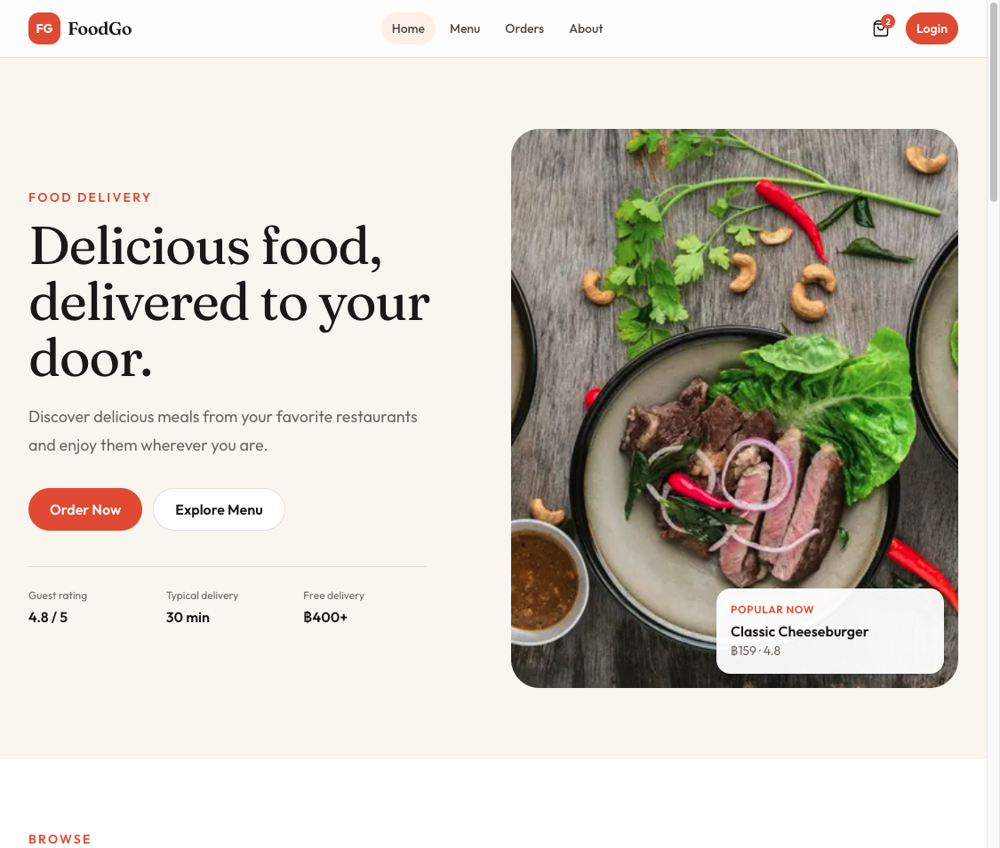
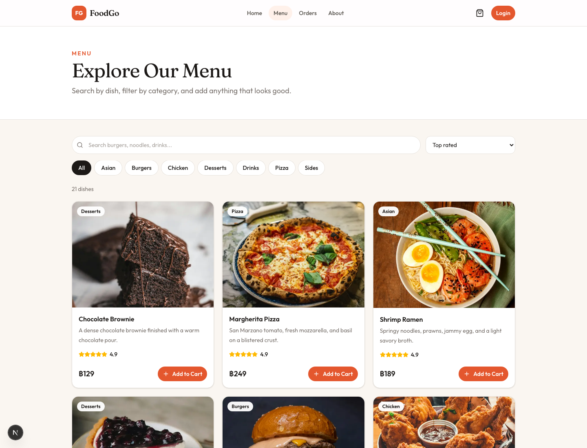
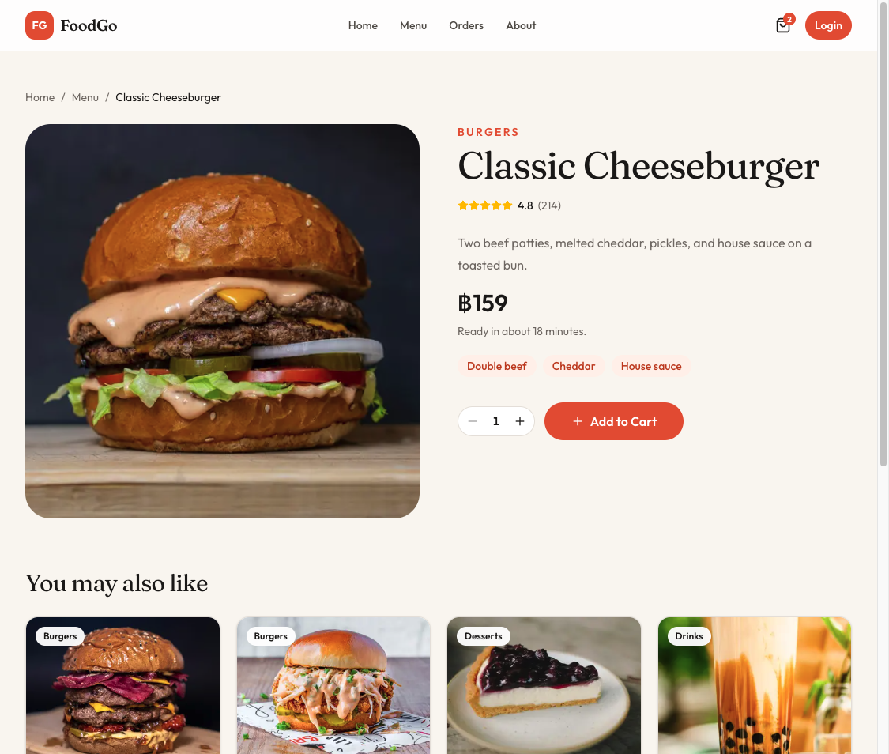
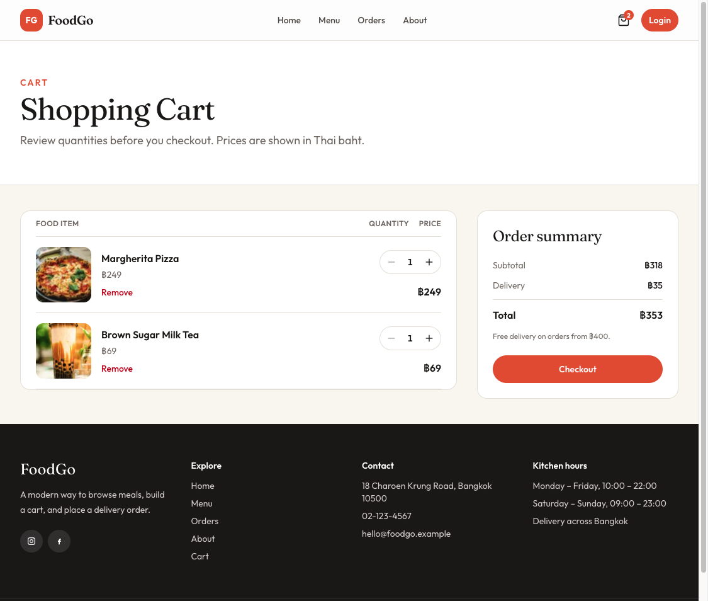
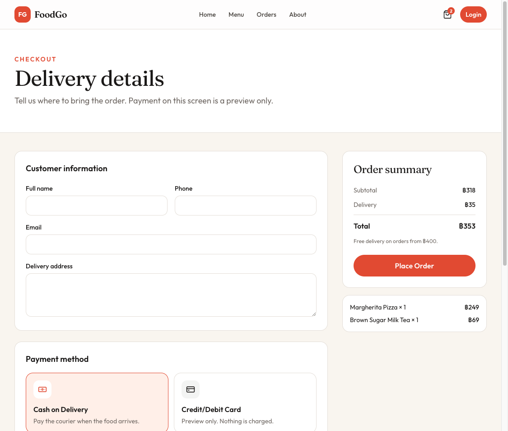
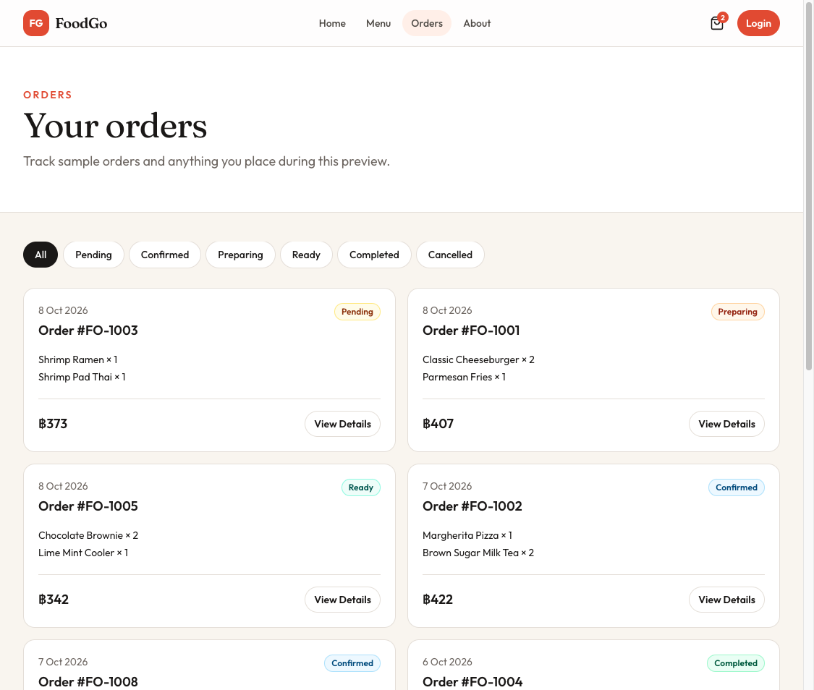
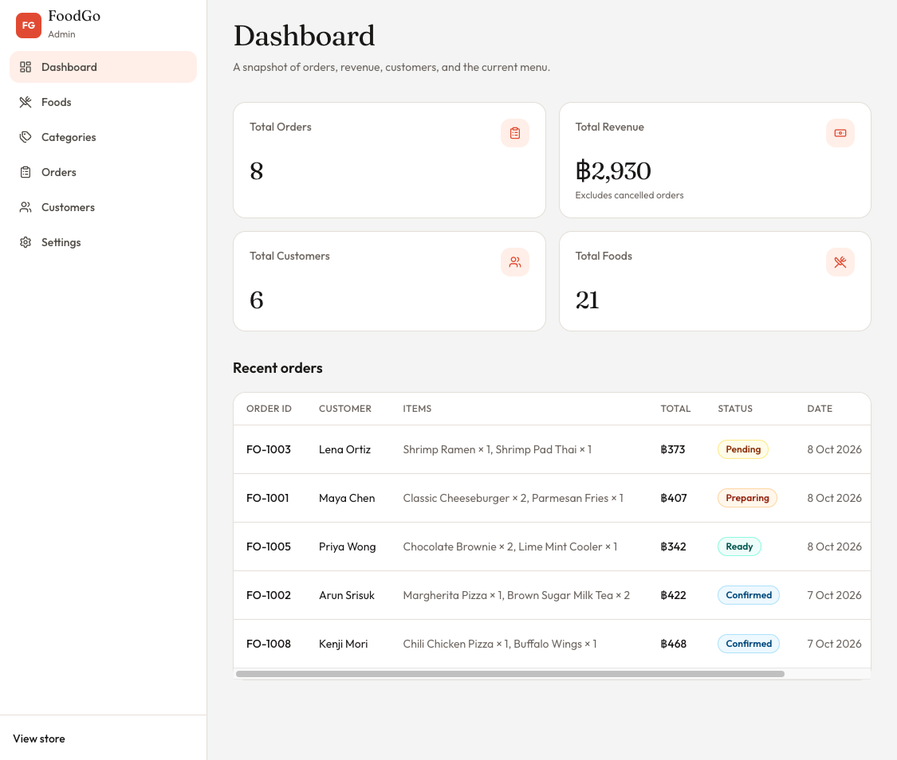
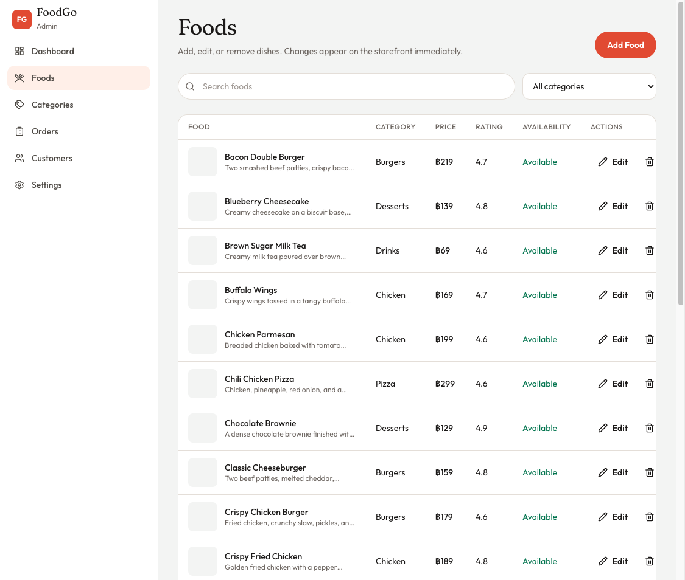
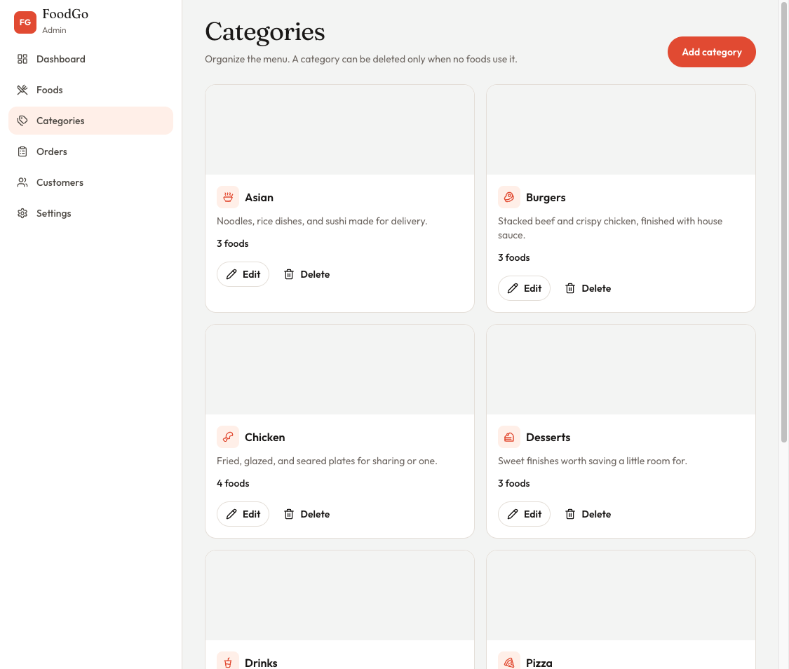
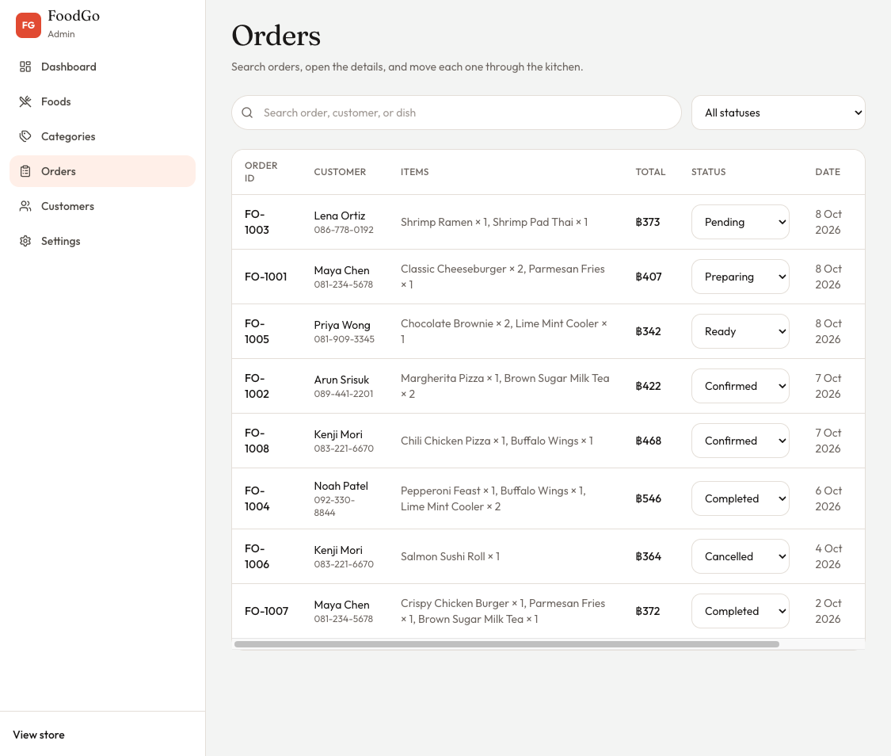

# FoodGo — Food Ordering System

FoodGo is a food ordering website. Customers browse a menu, open a dish, build a cart, and place a delivery order. Staff use an admin area to manage foods, categories, orders, and customers. Menu and order records are stored in MongoDB and reached through Next.js route handlers.

## Team Members

- [S Min Thant](https://github.com/sminthant)

## Tech Stack

- Next.js
- TypeScript
- Tailwind CSS
- MongoDB
- Mongoose
- REST API

## Features

### Customer

- Browse food
- Search and filter food
- View food details
- Add to cart
- Checkout
- View orders

### Admin

- Dashboard
- Food management
- Category management
- Order management
- Customer management

## Screenshots

### Homepage



### Menu



### Food details



### Cart



### Checkout



### Orders



### Admin dashboard



### Food management



### Category management



### Order management



## Development Status

GitHub is the source-code repository for FoodGo.

Vercel is used only as a development and preview deployment. It is not the final submission.

The final university deployment will run on a VM, as required by the assignment. Serverless hosting is not the production target.

## Getting Started

Create `.env.local` in the project root and set `MONGODB_URI` to the MongoDB Atlas connection string. That file is gitignored and must not be committed.

```bash
npm install
npm run seed
npm run dev
```

Open [http://localhost:3000](http://localhost:3000). The admin area is at [http://localhost:3000/admin](http://localhost:3000/admin).

`npm run seed` upserts the sample menu, customers, and orders. `npm run seed -- --reset` replaces them. In development, Admin → Settings can restore the same sample data.

The cart and store settings stay in the browser. Placing an order, editing a dish, or changing an order status writes to MongoDB. The checkout code `FIRST20` takes 20% off the food subtotal. Card payment on checkout is a preview and does not charge a card. The login screen does not create an account yet.
